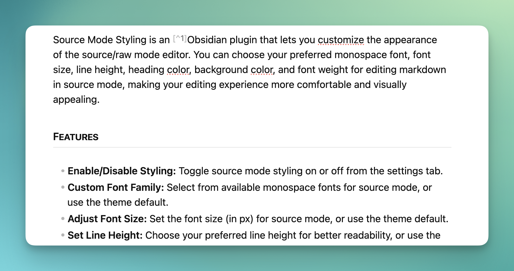
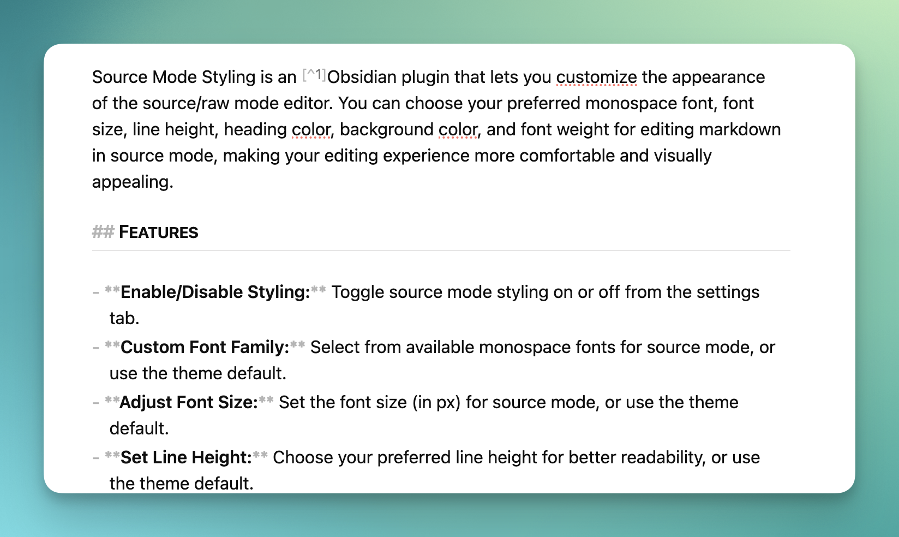
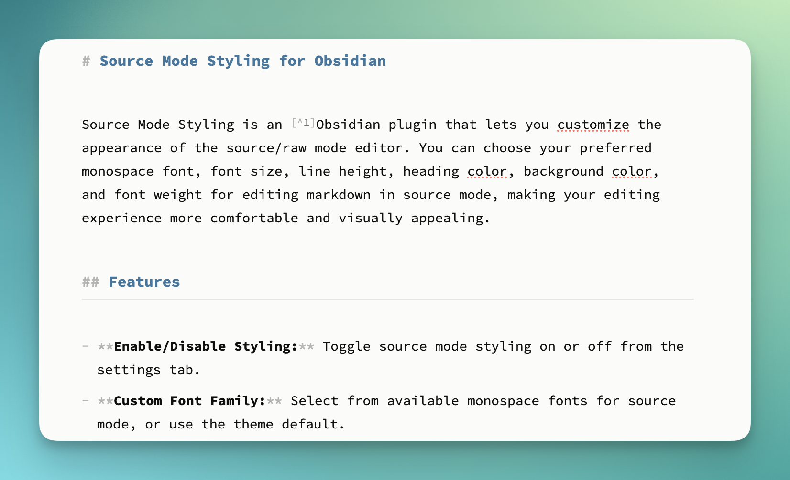

# Source Mode Styling

Differentiate your Obsidian source mode from Live Preview edit mode with a raw text like aesthetic using customizable monospace fonts and styling options.

## Overview

Source Mode Styling enhances Obsidian's source mode editor by applying monospace fonts and customizable styling that's familiar to developers and text editor users. While Obsidian's default source mode shows markdown syntax but retains most visual formatting, this plugin gives you an authentic "raw" editing experience providing greater differentiation with the Live Preview editor mode.

**Key Benefits:**

* **Full control** over source mode appearance
* **Monospace font detection** - automatically finds available fonts on your system
* **Real-time preview** - changes apply instantly
* **Theme-aware** - respects your theme's colours when desired
* **Cross-platform** - works on desktop and mobile

## Installation

### From Community Plugins (Recommended)

1. Open Obsidian Settings
2. Go to **Community plugins** and disable **Safe mode**
3. Click **Browse** and search for "Source Mode Styling"
4. Install and enable the plugin

### Manual Installation

1. Download the latest release from [GitHub Releases](https://github.com/chrishoward/sourcemode-styling/releases)
2. Extract the files to your vault's `.obsidian/plugins/sourcemode-styling/` directory
3. Reload Obsidian or restart the application
4. Enable the plugin in Settings → Community plugins

## Usage

### Quick Start

1. Open any markdown file in source mode
2. Go to **Settings → Community plugins → Source Mode Styling**
3. Customize your font and styling preferences

### Configuration Options

| Setting                | Description                       | Options                                    |
| ---------------------- | --------------------------------- | ------------------------------------------ |
| **Monospace font**     | Choose your preferred coding font | Auto-detected system fonts + theme default |
| **Font size**          | Adjust text size for readability  | 9-20px or theme default                    |
| **Font weight**        | Control text thickness            | Normal, Light, Semi-bold, Custom (100-900) |
| **Line height**        | Adjust vertical spacing           | 1.0-2.5 or theme default                   |
| **Heading colour**     | Customize heading appearance      | Custom colour picker or theme default      |
| **Background colour**  | Set editor background             | Custom colour picker or theme default      |

### Font Detection

The plugin automatically detects monospace fonts installed on your system, including popular options like:

* Source Code Pro
* Fira Code
* JetBrains Mono
* Consolas
* Monaco
* And many more...

## Examples

**Obsidian Live Preview mode**


### Before vs After

**Default Obsidian Source Mode:**

* Displays formatting syntax with theme styling
* Minimal visual differentiation from Live Preview mode
* Variable-width fonts
* Theme-dependent appearance



**With Source Mode Styling:**

* Clean, monospace text rendering
* Uses theme colours and styling
* Customizable colours and sizing
* True "raw" editor look and feel
* Clear differentiation from Live Preview editing



## Advanced Usage

### Theme Integration

The plugin works seamlessly with Obsidian themes:

* Use "Theme default" options to maintain theme consistency
* Override specific elements (fonts, colours) while keeping theme aesthetics
* Custom settings persist across theme changes

### CSS Customization

For advanced users, the plugin adds a class `.source-mode-raw` and generates CSS that can be further customized:

```CSS
/* All text */
.source-mode-raw .markdown-source-view.mod-cm6 .cm-scroller {
   /* Your styles */
}

/* Headings */
.source-mode-raw .markdown-source-view.mod-cm6 .cm-header {
  /* Your styles */
}
```

## Compatibility

* **Obsidian Version:** 0.15.0+
* **Platforms:** Windows, macOS, Linux, iOS, Android
* **Themes:** Compatible with all Obsidian themes
* **Other Plugins:** No known conflicts

## Troubleshooting

### Font Not Appearing?

* Ensure the font is properly installed on your system
* Try refreshing the plugin settings
* Check if the font supports monospace character spacing

### Settings Not Applying?

* Make sure you're in source mode (not live preview)
* Try toggling the plugin off and on
* Restart Obsidian if issues persist

### Mobile Issues?

* Font selection is limited to system fonts on mobile
* Some advanced features may not be available on mobile platforms

## Contributing

Contributions are welcome! Please see our [development documentation](CLAUDE.md) for setup instructions.

### Development Setup

1. Clone the repository
2. Run `npm install` to install dependencies
3. Run `npm run dev` for development with hot reload
4. Run `npm run build` to build for production

## Changelog

See [CHANGELOG.md](CHANGELOG.md) for version history and release notes.

## Requirements

- Minimumum verified on Obsidian 1.9.x

## License

MIT License © Chris Howard 2025

[](https://buymeacoffee.com/4e8cu9fzwy)
